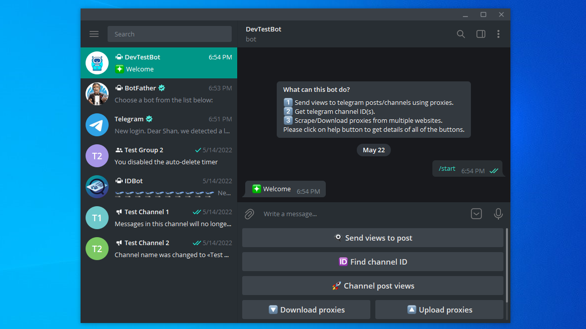

# 
Telegram Post Views Booster

Contact me to get a demo or more details.

More screenshots: [img/images.md](img/images.md)

### 🛒 How to buy
You can contact me to buy this program. The price of this tool would be $80.

### 💡 Features of the bot
1. Increase views on post by fowrding post to the bot
2. Find user id of channels/groups
3. Night mode - Turn of views sending on night time
4. Burst mode - Toggle views sending speed(Slow/Fast)
5. Register channels to send views on every new post
6. Scrape free proxies from websites

These are the main features of the bot. If you have your own specific requirements I can make the modifications according to that.

### ⚙️ Development details
You won't need telegram accounts to send views. This bot uses proxies for sending views. You can use free proxies or paid proxies depending on your choice.
- python 3.9.7
- telethon 1.24.0
- requests 2.27.1
- bs4(Beautiful Soup) 4.9.0

### 📞 Contact me
* Telegram - pycoder28
* Discord - pycoder#5722
